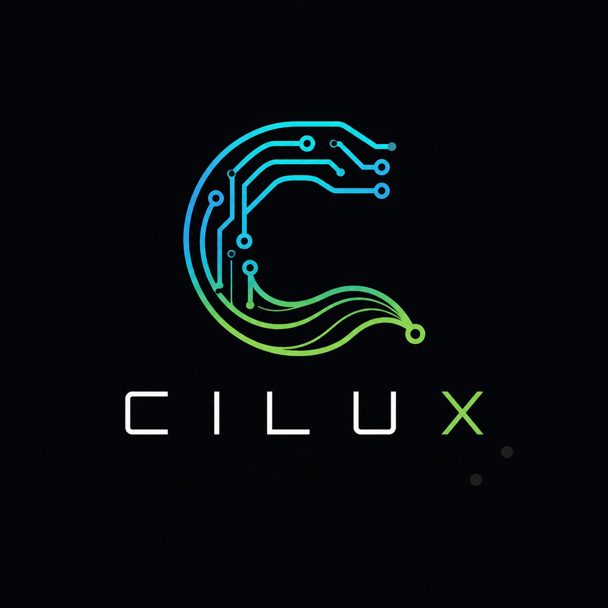

<div align="center">

<br><br>
<h1>Cilux</h1>
<p>
  Cilux Hardware Description
</p>
<p>
  
  
</p>

</div>


# Cilux

**Cilux** is a domain-specific programming language and compiler toolchain for describing, simulating,
and synthesizing digital hardware. It combines a small, expressive syntax for gates, circuits, clocks,
and sequential logic with a synthesis pipeline that lowers designs into BLIF netlists, and — via a bundled
Yosys build — into Verilog, JSON, or VHDL. Designs can also be rendered as ASCII/graphical schematics,
truth tables, and timing-diagram waveforms, all from inside the interpreter itself.

Cilux ships as a single Python codebase with:

- an **interpreter/compiler kernel** built around a plugin architecture (`core/`),
- a **language implementation** — types, operators, gates, circuits, functions, and file bridges (`lang/`),
- a **standard library** of common digital building blocks written in Cilux itself (`lib/builtin/std/`),
- a **REPL** with a custom multi-line `curses`-based editor (`REPL.py`),
- a **CLI entry point** (`main.py`) for running `.clx` files or inline code.

This document is the entry point into the full documentation set. See the other files in this folder
for deep dives into specific subsystems:

| Document | Contents |
|---|---|
| [`ARCHITECTURE.md`](./docs/ARCHITECTURE.md) | How the plugin/kernel system works: grammar composition, execution dispatch, scoping, parser caching |
| [`LANGUAGE_REFERENCE.md`](./docs/LANGUAGE_REFERENCE.md) | Full Cilux language syntax: types, operators, gates, circuits, clocks, `when`, imports, and every built-in function |
| [`SYNTHESIS_AND_BACKENDS.md`](./docs/SYNTHESIS_AND_BACKENDS.md) | The `synth()` elaboration pipeline, optimization passes, BLIF/Yosys/VHDL export, and schematic rendering engines |
| [`STANDARD_LIBRARY.md`](./docs/STANDARD_LIBRARY.md) | Reference for every circuit shipped in `std::*` (adders, muxes, ALU, comparators, converters, decoders, encoders) |

---

## 1. What Cilux Actually Is

Cilux is **not** a wrapper around Verilog/VHDL — it is its own small hardware description language (HDL)
with its own grammar, its own tree-walking interpreter, and its own gate-level synthesis pipeline written
from scratch in Python. Verilog, VHDL, JSON, and BLIF are treated purely as **export targets**, produced by
handing a Cilux design's synthesized netlist to a bundled WebAssembly build of Yosys
(`yowasp-yosys`) or to a hand-written VHDL code generator.

A minimal Cilux program looks like this:

```cilux
circuit half_adder {
    input a, b;
    output sum, cout;

    XOR(a, b) -> sum;
    AND(a, b) -> cout;
}

result = half_adder(1, 0);
print(result.sum, result.cout);   // 1 0
```

Running it:

```bash
cilux --code "circuit half_adder { input a, b; output sum, cout; XOR(a, b) -> sum; AND(a, b) -> cout; } print(half_adder(1,0));"
```

or, saved as a file:

```bash
cilux my_design.clx
```

or with no arguments at all, Cilux drops into an interactive REPL.

> ### Design Philosophy
>
> Cilux is built on a principle of radical minimalism: the language core provides nothing but the smallest,
> most irreducible primitives of digital logic, and deliberately nothing more — every higher-level behavior,
> from comparison to arithmetic to anything else that feels like it "should" be built in, is not a language
> feature at all, but simply another circuit, composed from the same primitives and grown into the standard
> library over time.


## 2. Key Language Capabilities

- **Combinational logic** — primitive gates `AND`, `OR`, `XOR`, `NOT`, `NAND`, `NOR`, `XNOR` are built-in
  functions available everywhere.
- **Structural composition** — `gate { ... }` and `circuit { ... }` blocks define reusable components with
  `input`/`output` ports; components are instantiated and wired together with the -> wire operator.
- **Bus/range syntax** — `input a[3:0];` expands to four scalar ports `a3, a2, a1, a0` under the hood.
- **Sequential logic** — `clock` declarations plus `when NAME @posedge { ... }` / `@negedge { ... }` blocks
  with non-blocking (<=) assignment describe registers and FSMs, driven by a discrete-event clock
  scheduler that supports both synchronous and asynchronous clocks.
- **Control flow** — `if` / `elif` / `else` for conditional combinational logic.
- **A small type system** — `int`, `bit` (auto-inferred for literal `0`/`1`), `bool`, `string`, `list`,
  `dict`, plus internal `gate`, `circuit`, `clock`, `module`, and result types.
- **A module system** — `import std::adder::half_adder;`, wildcard imports (`::*`), selective imports with
  aliasing (`{a as b}`), and namespaced access (`::`) into files, directories, or the built-in library.
- **Introspection & visualization built into the language** — `typeof()`, `table()` (ASCII truth tables),
  `wave()` (ASCII/SVG/PNG timing diagrams), `schematic()` (ASCII or matplotlib/schemdraw schematics),
  and `simulate()` to advance the clock scheduler.
- **Synthesis & export** — `synth()` lowers a `gate`/`circuit` into a flattened, optimized gate-level
  netlist; `blif()`, `verilog()`, `json()`, and `vhdl()` convert that netlist into standard EDA formats;
  `export(value, to="path.ext")` writes any exportable result to disk.

See [`LANGUAGE_REFERENCE.md`](./docs/LANGUAGE_REFERENCE.md) for the complete, precise syntax and semantics of
every construct summarized above.

## 3. Project Layout

```
Cilux/
├── main.py                  # CLI entry point (argparse: -v, -c, -g, <file>, or REPL)
├── REPL.py                  # Interactive curses-based multi-line REPL
├── registry.py              # Central plugin registry — defines PLUGINS list and create_kernel()
├── version.py                # __version__, __author__, build signature
├── requirements.txt          # lark, matplotlib, networkx, pillow, platformdirs, schemdraw, yowasp-yosys, zstandard
│
├── core/                     # The language-agnostic interpreter core
│   ├── plugin.py              # Plugin base class + Value wrapper base class
│   ├── engine.py               # Kernel: grammar composition, tree-walking execution, error reporting
│   ├── context.py               # Lexical scope / variable environment (Context)
│   └── parser_cache.py           # Disk-cached, content-hashed Lark LALR parser builder
│
├── lang/                     # Everything that defines the Cilux language itself, as Plugins
│   ├── types/                  # int, bool, str, list, dict, bit, port/wire, module, builtin-function wrapper
│   ├── expr/                    # Core `expr` / `expr_stmt` grammar plugin (the expression grammar backbone)
│   ├── oprators/ [sic]           # range (`a[3:0]`), access (`::`), assignment, dot-access, wiring (`->`), if/elif/else
│   ├── structs/                  # gate, circuit, clock, when/seq_assign, base logic gates, clock scheduler
│   ├── funcs/                    # print, typeof, table, wave, simulate, synth/ (elaborator + passes + BLIF), schematic
│   ├── io/                        # import (module loader/resolver), export (generic exporter), path validation
│   ├── bridges/                    # blif, yosys (verilog/json via YoWASM Yosys), vhdl (via a hand-written Verilog→VHDL engine)
│   └── engines/                     # ascii_draw_engine, render_schemdraw_engine (matplotlib/schemdraw), vl2vhd_engine
│
├── lib/builtin/std/          # Standard library, written in Cilux (.clx): adder, mux, alu, comparator,
│                              #   converter, decoder, encoder
│
└── share/fonts/               # Bundled monospace font used for PNG rendering of tables/waves/ASCII art
```

## 4. Installation & Running

Cilux targets Python 3.12+ and depends on:

```
lark, matplotlib, networkx, pillow, platformdirs, schemdraw, yowasp-yosys, zstandard
```

### Platform Support

Prebuilt binaries and installer packages are currently available for **Windows** only and can be downloaded from the [Releases](../../releases) page.
Support for **Linux** and **macOS** is planned for future releases. Until then, Cilux can still be built and run from source on these platforms.


Install dependencies and run from source:

```bash
pip install -r requirements.txt
python main.py                       # REPL
python main.py my_design.clx         # run a file
python main.py --code "print(1)"         # run inline code
python main.py -v                    # print version
python main.py -g grammar.lark       # dump the fully composed Lark grammar to a file
```

The project can also be compiled into a single native executable with
[Nuitka](https://nuitka.net); see the note in [`ARCHITECTURE.md`](./docs/ARCHITECTURE.md#packaging-notes) about
the two dependencies (`wasmtime`, `yowasp-yosys`) that need explicit binary-data inclusion when doing so.

## 5. Status

Cilux is an actively evolving personal/experimental compiler project (version `0.1.0`). Based on the
project's own `TODO` file, current known limitations include:

- **Signals are strictly 1-bit** at the synthesis level — `input a[3:0]` is *sugar* that expands to four
  independent scalar ports at the language layer, but the elaborator/BLIF backend does not yet track true
  multi-bit buses as a first-class concept (see the `SynthResult`/`NetlistDB.get_const` design notes in
  [`SYNTHESIS_AND_BACKENDS.md`](./docs/SYNTHESIS_AND_BACKENDS.md#known-limitation-no-native-multi-bit-signals)).
- Multi-clock `when` conditions (`when (clk or rst) @posedge`), `assert`, default arguments, and
  dot-access assignment are on the roadmap but not implemented yet.
- BLIF export is close to complete; EDIF export is planned but not implemented.
